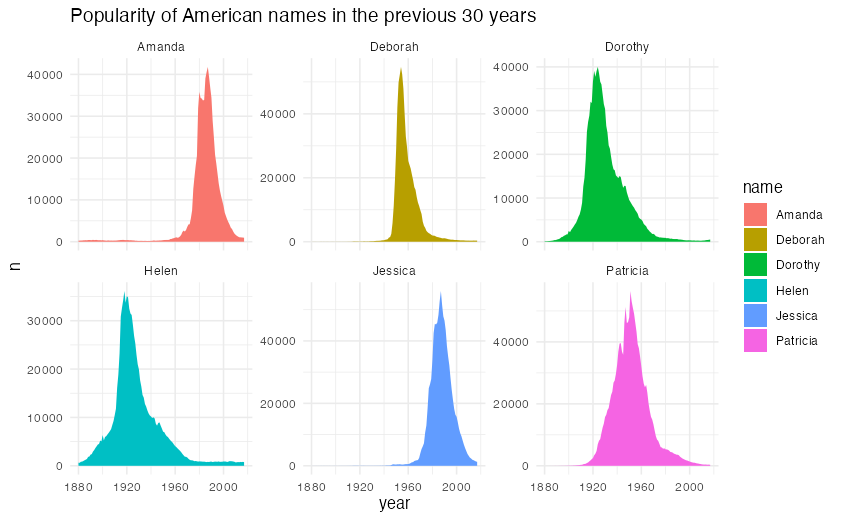

# ggalttext

Make ggplot2 fully accessible by generating alternative text. `ggalttext` provides a single function, `generate_alt_text()`, which takes any ggplot2 object and generates a string describing the graph's content (**in multiple languages!**).

This text is **not** intended to describe the plot word for word, nor how it was created. Rather, it aims to be concise and provide an overview of the plot's content, for example:

- the kind of chart(s)
- the number of chart(s) for facets
- the title
- ...

<br>

## Installation

```r
install.packages("ggalttext", repos = c("https://y-sunflower.r-universe.dev"))
```

<br>

## Motivations

Data visualizations are often shared without meaningful alternative text, making them inaccessible to people using screen readers. While adding alt text is straightforward in principle, in practice it's easy to fall into vague/unhelpful descriptions. `ggalttext` aims to remove that friction by automatically generating descriptions, helping make visualizations **more accessible by default**.

Learn more: [https://www.section508.gov/create/alternative-text/](https://www.section508.gov/create/alternative-text/)

<br>

## Example

```r
library(ggplot2)
library(babynames)

plot_data <- babynames |>
    subset(name %in% c("Amanda", "Jessica", "Patricia", "Deborah", "Dorothy", "Helen"))

plot <- ggplot(plot_data, aes(x = year, y = n, group = name, fill = name)) +
    geom_area() +
    theme(legend.position = "none") +
    labs(title = "Popularity of American names in the previous 30 years") +
    theme(
        legend.position = "none",
        panel.spacing = unit(0.1, "lines"),
        strip.text.x = element_text(size = 8)
    ) +
    facet_wrap(~name, scale = "free_y")

plot
```



```r
library(ggalttext)

generate_alt_text(plot)
#> "Area chart split into 6 small charts arranged in a 2-row by 3-column grid,
# titled “Popularity of American names in the previous 30 years”."
```

### Language

By default, it generates alt text in English, but there are other options such as `lang = "fr"` (for French):

```r
generate_alt_text(plot, lang = "fr")
#> "Graphique en aires reparti en 6 petits graphiques organises dans une grille de
# 2 lignes par 3 colonnes, avec pour titre « Popularity of American names in the
# previous 30 years »."
```

and `lang = "de"` (for German):

```r
generate_alt_text(plot, lang = "de")
#> "Flaechendiagramm, aufgeteilt auf 6 kleine Diagramme in einem Raster mit 2 Zeilen
# und 3 Spalten mit dem Titel „Popularity of American names in the previous 30
# years“."
```

> [!TIP]
> If you would like to see another language available here, please [open an issue](https://github.com/y-sunflower/ggalttext/issues)!

### Flexibility

You can be more flexible in how the alt text is generated thanks to the `from` argument. Since ggplot2 objects can include built-in alt text (via `labs(alt = "Here goes the text")`), you can choose whether to use that text or the one generated by `ggalttext`.

```r
generate_alt_text(plot, from = "default") # Default value
generate_alt_text(plot, from = "auto")
generate_alt_text(plot, from = "origin")
```

- `"default"`: always generate alt text with `ggalttext`.
- `"auto"`: use existing alt text when it is non-empty; otherwise generate alt text with `ggalttext`.
- `"origin"`: always return `ggplot2::get_alt_text(p)` as-is.

<br>

## How to make accessible visualizations?

`ggalttext` will generate fairly good alternative text, provided your chart design follows accessibility guidelines:

- A title is a title, not just text in large font: always use `labs()` to add a title.
- Use color palettes suitable for people with color blindness. See [colorblindr](https://github.com/clauswilke/colorblindr).
- Use high color contrast: if the background color is light, the text should be dark.
- For complex graphics, write the alternative text yourself, as automated tools such as `ggalttext` may not be accurate.

<br>

## How it works

**`ggalttext` does <u>not</u> use any AI, OCR, or similar technologies**. Instead, it remains much more lightweight (no additional dependencies, no additional installation, etc.) by programmatically inspecting your plot. This is possible because `ggplot2` stores every geom, layer, annotation, etc., within your figure object.

In my experience, AI is **particularly effective** at generating alternative text. However, feeding an image into an AI to get a result isn't very cost-effective: in most cases, `ggalttext` does 90% of the work for 1% of the cost (These aren't real numbers; they're just there to illustrate my point).

> [!NOTE]
> _"Cost"_ here refers to financial cost, the cost associated with the software's complexity, and the energy-to-performance ratio.

<br>

## Coding with AI?

If you're coding with AI, this page is pretty much all they need to know! Just copy everything above this section and send it to your favorite AI/LLM.
